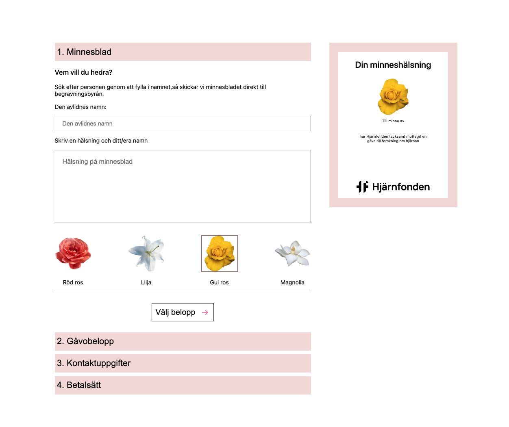
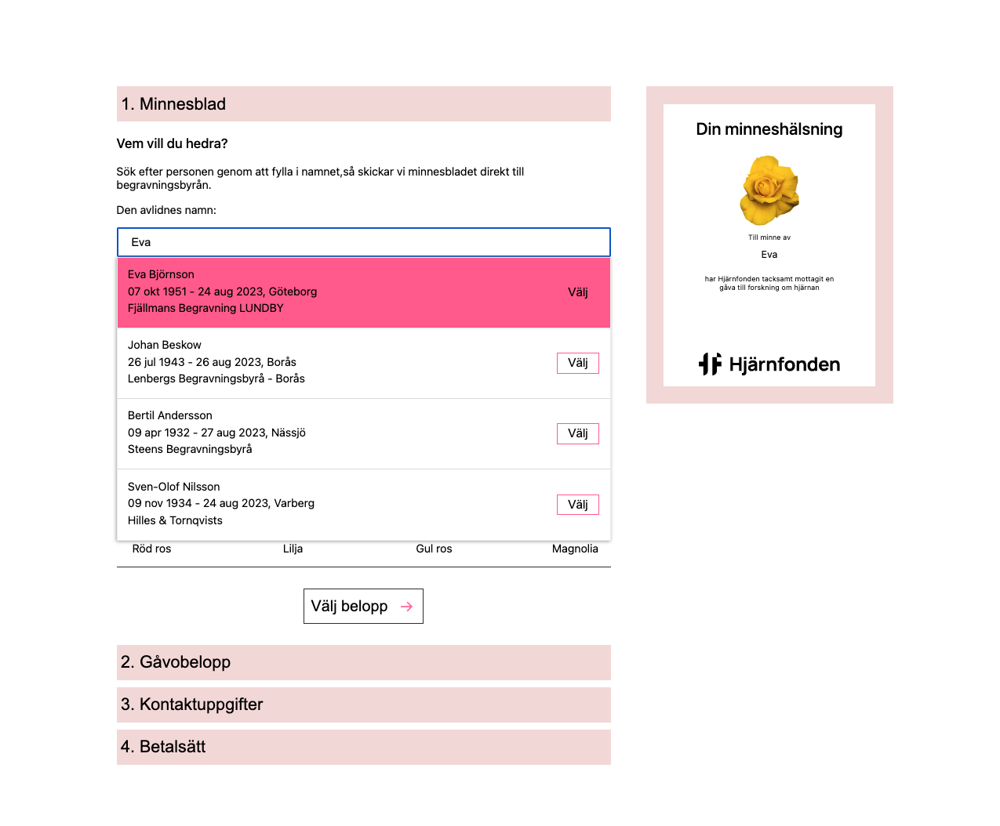
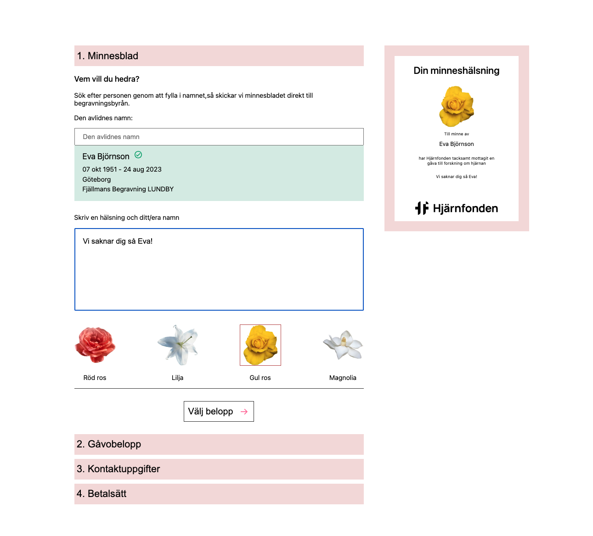
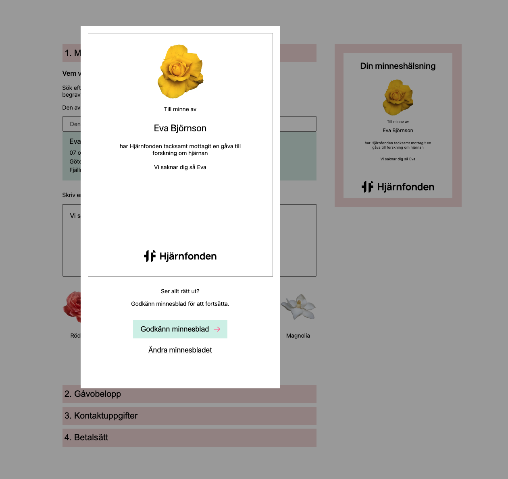
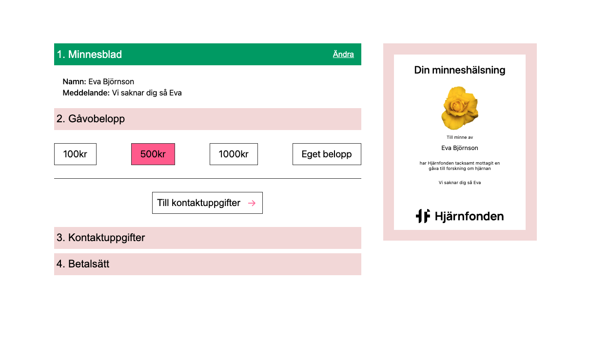
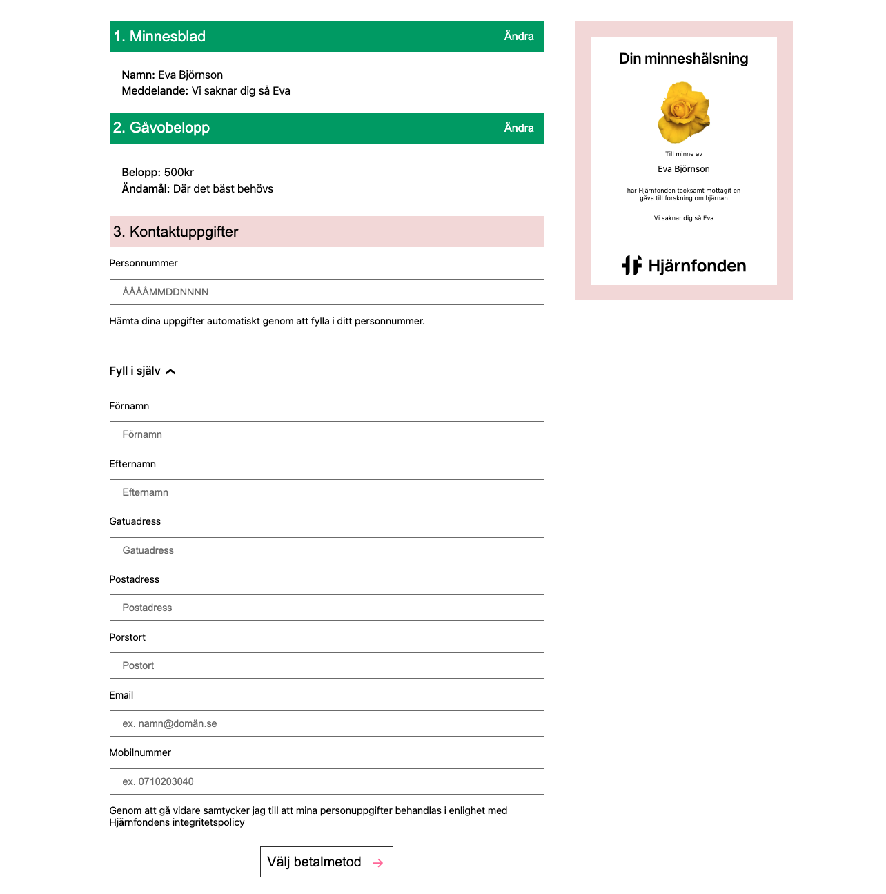
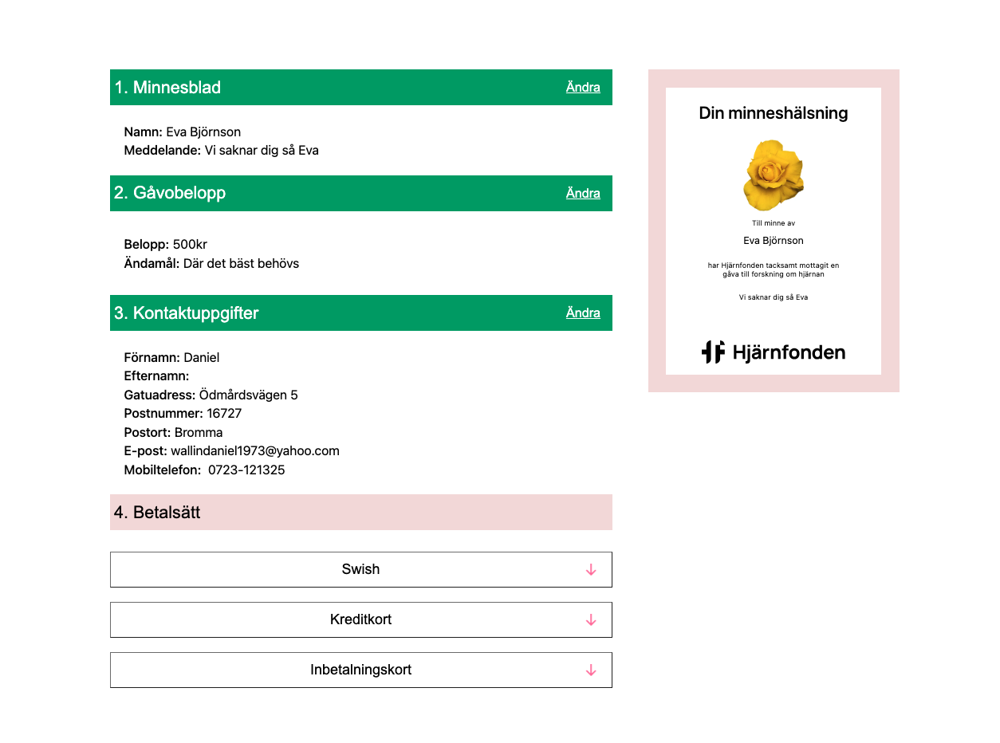

# checkout
Checkout flöde för hjärnfonden.

## Tech
- Nextjs
- CSS modules
- Redux-toolkit
- TypeScript

## Implementation
Separat modul för respektive steg i checkout flödet.
Redux kommunicerar mellan moduler. Lista med personer
under första sektionen är bara mockade exempelnamn.

## Ej implementerat (för att hålla nere scope)
- validering
- betalning (formulärsfält)
- responsiv layout
- fler återanvändbara komponenter

## Screenshots

